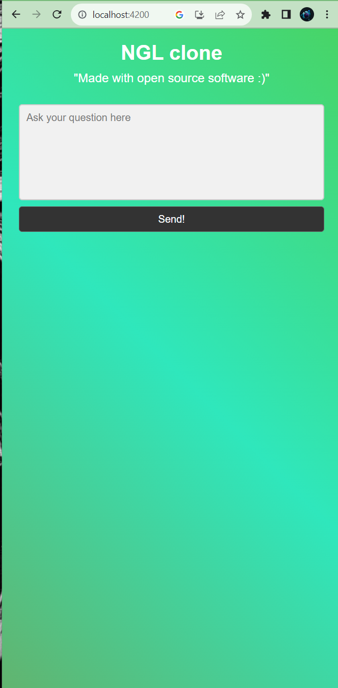
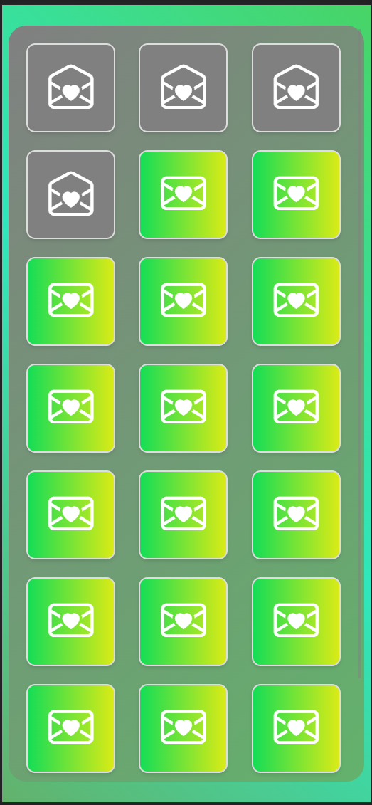
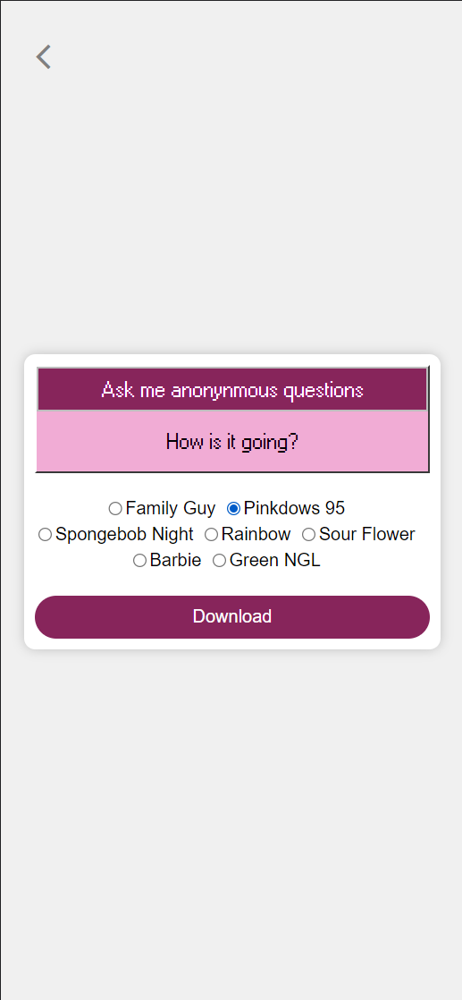
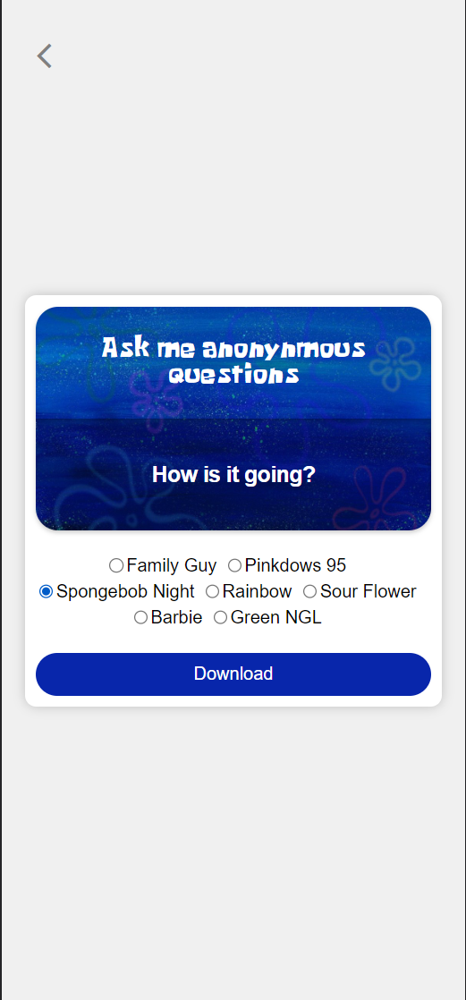
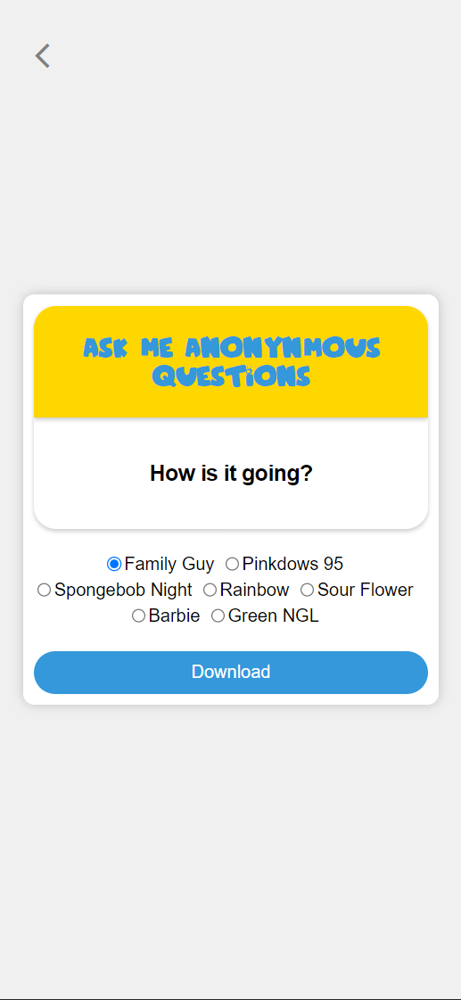
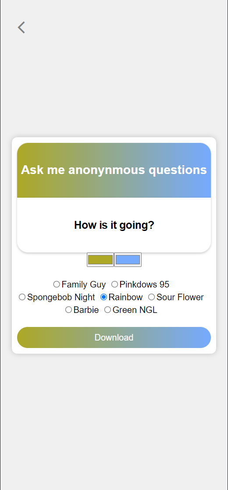

# NglClone Frontend
This is the frontend part of the ngl.link clone I've developed using Angular. Since they're a startup with multiple employees, I thought about how challenging it would be to write it from scratch. You can also find the backend part [here](https://github.com/egeulk/ngl-clone-backend)

## Features
- More Greenish interface, just because I prefer that color :)

<table>
  <tr>
    <td></td>
    <td></td>
  </tr>
</table>

- Works on every platform due to nature of Angular unlike ngl.link
- Various new templates inspired by Windows 95 (which uses the css from one of my [projects](https://github.com/egeulk/angular-windows-95-pink)), Spongebob, Family Guy and a new one that can be customized by the colors users pick.

<table>
  <tr>
    <td></td>
    <td></td>
    <td></td>
    <td></td>
  </tr>
</table>

- After downloading the generated image the service saves and remembers what template you've chosen, something that was lacking in ngl.link
- For feature parity's sake and to prove I could do it, a replica of the green template from ngl.link
- Authentication is required to view the dashboard, unlike ngl.link, where there is no way to log in or sync questions when you download it.

# Running

## Running on Local

Before running, make sure you have the [backend](https://github.com/egeulk/ngl-clone-backend) downloaded and running.
Run `ng serve --ssl` for a dev server. SSL is required because the communication between the frontend and backend uses WSS to check for new messages.  Navigate to `https://localhost:4200/`. Since it uses a self-signed SSL make sure you accept the warnings.

## Running on Heroku

Before deploying, make sure you've deployed the backend first and edit the environments/environments.prod.ts file to point to the URL containing the backend. The rest follows a similar fashion to deploying apps on Heroku. You can connect a Github repository and make it deploy every commit or install the Heroku CLI and push your changes to Heroku. More detailed instructions are [here](https://devcenter.heroku.com/articles/git)
